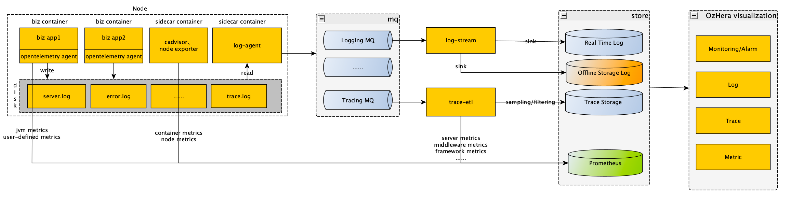

# OzHera

<b>OzHera:Application Observable Platform in the Cloud Native Era</b>

## What is OzHera?
OzHera is an Application Observable Platform in the Cloud Native Era. open-sourced by the R&D efficiency team of Xiaomi-China region. Centered around applications, it integrates metrics monitoring, link tracing, logging, and alerts. It achieves a seamless connection and interaction from metrics to tracing to logging. Moreover, OzHera offers a comprehensive monitoring dashboard featuring application health status lists, application metric boards, interface overviews, application overviews, gateway overviews, etc., along with clear and concise visual text alerts, enabling users to pinpoint issues accurately and efficiently.

---

## Architecture

---

## Features
- Accurate: Extract usability metrics based on business error codes.
- Fast: Integrated metrics-tracing-logging.
- Economical: <0.1% storage cost, meets 99.9% of tracing demands.
- Cloud-native Friendly: Adheres to the Opentracing standard, deeply adapts to K8S, and integrates multiple star open-source products like Opentelemetry, Grafana, Prometheus, ES, and more.
- Enterprise-level observability product.

---

## Getting Started
### Live Demo
+ [Live Demo](https://ozhera.demo.m.one.mi.com/)
+ username: ozhera@ozhera.com
+ password: 123456

### Official Website

Welcome to visit the [official website](https://ozhera.m.one.mi.com/) of OzHera.

### Community Website

Welcome to visit the [community website](https://m.one.mi.com/index) of OzHera, where we will publish OzHera's technical documentation, thoughts, and achievements. We welcome everyone to join the discussion.

### Deployment
[operator-usage-document.md](readme%2Fdeploy%2Fozhera-deploy-document.md)

---

### Application Integration
[application-integration-document.md](readme/application-integeration/application-integration-document.md)

---

### User Manual
[user-manual-document.md](readme/user-manual/user-manual-document.md)

---

### Contributing
Contributors are welcomed to join ozhera project. Please check [contributing.md](readme%2Fcontributing%2Fcontributing.md) about how to contribute to this project.

How can I contribute?
- Take a look at issues with tags marked [good first issue](https://github.com/XiaoMi/ozhera/labels/good%20first%20issue) or [contribution welcome](https://github.com/XiaoMi/ozhera/labels/help%20wanted).
- Answer questions on [issues](https://github.com/XiaoMi/ozhera/issues).
- Fix bugs reported on [issues](https://github.com/XiaoMi/ozhera/issues), and send us a pull request.
- Review the existing [pull request](https://github.com/XiaoMi/ozhera/pulls).

---

## User List

If you are using OzHera and think that it helps you or want to contribute code for mone, please add your company to the user list to let us know your needs.

|||||
| :---: | :---: | :---: | :---: |

