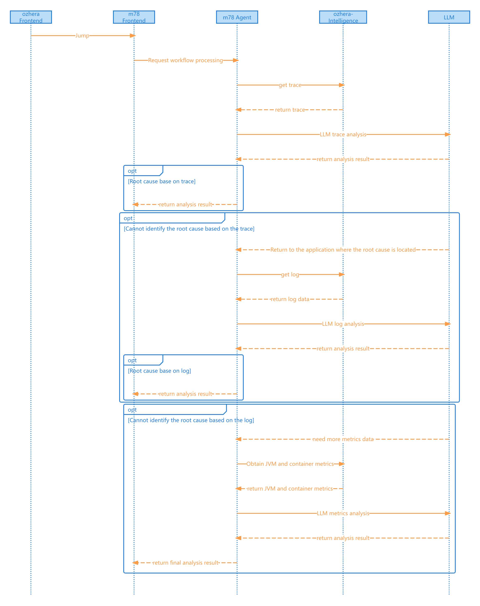

<!--

    Licensed to the Apache Software Foundation (ASF) under one
    or more contributor license agreements.  See the NOTICE file
    distributed with this work for additional information
    regarding copyright ownership.  The ASF licenses this file
    to you under the Apache License, Version 2.0 (the
    "License"); you may not use this file except in compliance
    with the License.  You may obtain a copy of the License at

      http://www.apache.org/licenses/LICENSE-2.0

    Unless required by applicable law or agreed to in writing,
    software distributed under the License is distributed on an
    "AS IS" BASIS, WITHOUT WARRANTIES OR CONDITIONS OF ANY
    KIND, either express or implied.  See the License for the
    specific language governing permissions and limitations
    under the License.

-->

# Overview
+ Apache OzHera(incubating) Intelligence Platform is responsible for generating intelligent-related functionalities.
+ Currently, features are under development.
+ Planned features to be developed:
    + Root cause analysis, including trace, alerts, and topology-based intelligent analysis at the application level.

# Module Introduction

## ozhera-intelligence-server

+ Service to initiate intelligent functionalities.
+ Access to the ozhera-intelligence-server requires the x-token to be included in the header for authorized access to ozhera's data.

## ozhera-intelligence-service

+ LogService: Retrieves log data
+ MetricsService: Retrieves monitoring metric data
+ TraceService: Retrieves trace data

# Important Dependencies
It relies on a Xiaomi open-source [Agent builder platform--m78](https://github.com/XiaoMi/mone/tree/master/m78-all)

# Intelligent Workflow (Sequence Diagram)

# LLM Environment Variables
Currently, the LLM class is used for invoking large language models (LLMs). The required environment variables (env vars) are defined in the LLMProvider class.

## Prerequisite:
A base LLM_PROVIDER env var must be set to specify the desired LLMProvider.

## Example:
To use **DeepSeek**, follow these steps:

Set LLM_PROVIDER=DEEPSEEK.

Refer to the LLMProvider class for DeepSeek's specific requirements. In this case, DEEPSEEK_API_KEY is mandatory.
Configure the API key:

DEEPSEEK_API_KEY=xxx-xxxxx  

## Recommended Models
Given that this use case involves **large-scale data analysis** with significant logical reasoning and analytical processing, it is advisable to leverage high-performance inference-optimized models or models with strong code-generation capabilities available on the market.

## Suggested Criteria:

- High accuracy in complex reasoning tasks.
- Robust contextual understanding for analytical workflows.
- Efficient handling of long-context prompts (if applicable).

Examples include models fine-tuned for reasoning-intensive workloads or those excelling in programmatic problem-solving.