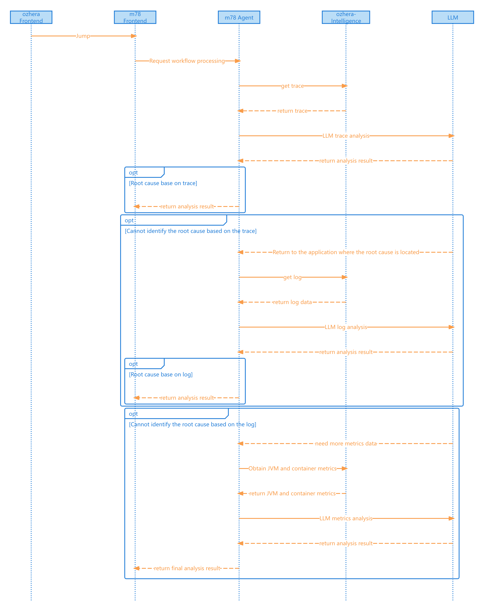

<!--

    Licensed to the Apache Software Foundation (ASF) under one
    or more contributor license agreements.  See the NOTICE file
    distributed with this work for additional information
    regarding copyright ownership.  The ASF licenses this file
    to you under the Apache License, Version 2.0 (the
    "License"); you may not use this file except in compliance
    with the License.  You may obtain a copy of the License at

      http://www.apache.org/licenses/LICENSE-2.0

    Unless required by applicable law or agreed to in writing,
    software distributed under the License is distributed on an
    "AS IS" BASIS, WITHOUT WARRANTIES OR CONDITIONS OF ANY
    KIND, either express or implied.  See the License for the
    specific language governing permissions and limitations
    under the License.

-->

# 概述
+ Apache OzHera(incubating)智能化平台，负责产生智能化相关功能。
+ 目前功能开发中
+ 计划将要开发的功能
  + 根因分析。包括Trace、报警、应用层面的基于拓扑图的智能分析。
# 模块功能介绍

## ozhera-intelligence-server

+ 智能化功能启动服务。
+ ozhera-intelligence-server访问需要header中带上x-token，实现有权限的访问ozhera的数据。

## ozhera-intelligence-service

+ LogService，取日志数据
+ MetricsService，取监控指标数据
+ TraceService，取链路数据

# 重要依赖
会依赖小米开源的一款[Agent平台——hive](https://github.com/XiaoMi/mone/tree/master/m78-all)

# 智能化工作流程（时序图）

# 启动依赖
## LLM环境变量
目前使用LLM类进行大模型调用，它所需要的env都在LLMProvider类中，首先需要一个基础的LLM_PROVIDER的env，来指定使用的LLMProvider。

**示例**：
比如想要使用DEEPSEEK

首先需要设置LLM_PROVIDER=DEEPSEEK
然后再根据LLMProvider类中的DEEPSEEK，看他需要哪些环境变量。这里DEEPSEEK需要使用DEEPSEEK_API_KEY，所以我们还需要设置DEEPSEEK_API_KEY=xxx-xxxxx

## 推荐使用的模型
由于这里可能会分析大量数据，而且具有大量的逻辑推理、分析，使用市面上比较好的推理模型或者代码能力较强的模型会比较好