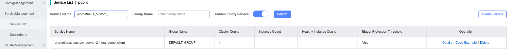

# OzHera Custom Monitoring Documentation

Bold **Important** content is key, please read carefully.

## I. Download, Compile

Download the open-source code:

https://github.com/XiaoMi/ozhera/tree/master/prometheus-starter-all

After a successful compilation, push the pom to the company's Maven repository, or refer to the local Maven repository for debugging.

## II. Dependency Environment Variables

`mione.app.name`: Used to record the application id and application name, the format is appId-appName. e.g., 1-test, where 1 is the appId, and test is the appName. If it's empty, the program defaults to using none. The application is very important metadata in OzHera, and all observable data displays are related to the application.

`TESLA_HOST`: Used to record the current physical machine IP, displayed in the trace's process.tags. In k8s, it gets the pod's IP.

`PROMETHEUS_PORT`: Used to expose the Prometheus metric pulling HttpServer port number, defaulting to 5555.

## III. Import POM

```xml
    <dependency>
      <groupId>run.mone</groupId>
      <artifactId>prometheus-diy-starter</artifactId>
      <version>0.0.1-SNAPSHOT</version>
    </dependency>
```

**Important!!!**

1. For custom monitoring data, do NOT record non-enumerable values like traceId and timestamp. Excessive logging of this data can cause performance issues.

2. During the project initialization phase, directly call the `PrometheusConfigure.init(nacosAddr, serverType)` method for initialization.

   `nacosAddr`: nacos address, ip:port

   `serverType`: either `staging` or `online`, used for generating metric name prefixes

   Just ensure that the initialization of the `PrometheusConfigure.init()` method is called before any monitoring points.

   ```java
   import com.xiaomi.mione.prometheus.starter.all.config.PrometheusConfigure;

   PrometheusConfigure.init(nacosAddr, serverType);
    ```
   For example:

   

   After the service starts, search for `prometheus_custom_server_${project_id}_${project_name}` in the nacos service list. If it can be found, it means that the registration with nacos was successful. **Note**: When searching, the hyphens in `${project_name}` should be replaced with underscores.

    For example:
    
    

3. When logging metrics, avoid using Chinese characters, hyphens, backslashes, dots, and other special characters in the metric name, as they can result in illegal metric names.

## IV. Custom Monitoring Examples

In the aforementioned pom, the OzHera team has encapsulated three types of Prometheus data types: count, Gauge, and Histogram. These generally fulfill the needs for custom business monitoring.

### 1. Counter

#### 1) Overview

Counter: An always-increasing counter. We can use it to record the frequency of certain events in applications. By storing this data in a time series manner, we can easily understand the rate changes of the event occurrences, such as for displaying QPS, error counts, etc.

#### 2) Code Example

```java
import com.xiaomi.youpin.prometheus.all.client.Metrics;

Metrics.getInstance().newCounter("testCounter","methodName","url").with("ok","/test/ok").add(1, "ok","/test/ok");
```

In this context, "testCounter" is the metric name, "methodName" and "url" are label names, "ok" and "/test/ok" are the respective label values, and `add(1)` records this metric data once.

### 2. Gauge

#### 1) Overview

Gauge: A meter that can both increase and decrease.

Unlike Counter, the Gauge type of metric emphasizes reflecting the current state of the system. Therefore, this type of metric can both increase and decrease its sample data and can be used for metrics such as current CPU usage, current disk usage, and other scalar values.

#### 2) Code Example

```java
Metrics.getInstance().newGauge("testGauge","methodName","url").with("gauge","/test/gauge").set(12, "gauge","/test/gauge")
```

In this context, "testGauge" is the metric name, "methodName" and "url" are label names, "gauge" and "/test/gauge" are the respective label values, and `set(12)` sets this metric's value to 12.

### 3. Histogram

#### 1) Overview

Histogram: Analyzing data distribution.

Beyond Counter and Gauge monitoring metrics, the OzHera team has also encapsulated the Histogram metric type. In most cases, people tend to use the average value of certain quantified metrics, such as the average CPU usage or the average response time of pages. The problem with this approach is clear. Taking the average response time of system API calls as an example: if most API requests maintain a response time within the range of 100ms, but some requests take as long as 5s, this can cause some WEB pages' response times to drop to the median. This phenomenon is known as the "long-tail" issue. Through Histogram, one can quickly understand the distribution of monitoring samples.

#### 2) Code Example

```java
double[] buckets = new double[]{0.01, 0.1, 1.0, 5.0, 10.0, 20.0, 40.0, 80.0, 200.0, 300.0, 400.0, 600.0, 800.0, 1000.0,2000.0,3000.0};

long begin = System.currentTimeMillis();

// 你的业务代码
long now = System.currentTimeMillis();

Metrics.getInstance().newHistogram("testHistogram", buckets, "methodName","url").with("histogram","/test/histogram").observe(now-begin, "histogram","/test/histogram");
```

Firstly, you need to create a distribution "bucket". In the example, it's a time-consuming bucket. "testHistogram" is the metric name, "methodName" and "url" are label names, and "histogram" and "/test/histogram" are the corresponding label values. The `observe()` function can be simply understood as the value falling into the bucket. For example, if `now-begin=11`, it would fall into the "10.0 ~ 20.0" corresponding bucket.

## V. Verification

Including the above pom will automatically start a simpleHttpServer, defaulting to port 5555, which can be customized by setting the PROMETHEUS_PORT environment variable. After starting the project locally, you can search for "start prometheus server" and check if the startup logs indicate a successful launch.


Once successful, based on your own logging method, create some logging data (e.g., log once every time an HTTP interface is accessed), and then visit localhost:5555/metrics for verification.


After successful local verification, once deployed to testing or production, you can first search for your metrics on the prometheus dashboard to verify whether the metrics are normal.

The metric name structure is:

`${serverType}_${appName}_${custom_metric_name}`

`${serverType}`: Is the value of the `serverType` argument when calling `PrometheusConfigure.init(nacosAddr, serverType);`.

`${appName}`: Is the value of the environment variable `mione.app.name` with hyphens replaced by underscores.

`${custom_metric_name}`: Is the first argument when custom logging, calling `Metrics.getInstance().newHistogram`, `Metrics.getInstance().newCounter`, `Metrics.getInstance().newGauge`. If it's of Counter type, append `_total`; if it's of Histogram type, append `_bucket`.

For example:


## VI. Configuring Grafana Charts

On OzHera's Dashboard page, there is a custom monitoring dashboard on the right. Clicking on it will by default redirect you to the corresponding grafana monitoring page for this service.


After collapsing all the directories, there is a custom metric directory at the bottom. Please create your custom monitoring charts in this directory.


In the custom monitoring chart, first select the OzHera Prometheus data source and input your own promql statement.


For more on using Grafana monitoring charts, see: https://grafana.com/docs/grafana/v9.2/panels-visualizations/

**Important!!! Ignoring this may result in your created charts being deleted in the future.**

1. In Grafana, OzHera has generated several built-in charts for the business, including http, dubbo, jvm, db, redis, etc. Custom metrics for businesses must be edited within the custom metrics. This is because built-in charts might be updated in the future, and if your charts are elsewhere, they might get overridden.

   For the syntax of custom monitoring's PromQL, you can refer to the following documentation:

   Official Documentation: https://prometheus.io/docs/prometheus/latest/querying/functions/

   Prometheus Book: https://yunlzheng.gitbook.io/prometheus-book/parti-prometheus-ji-chu/promql/prometheus-query-language
