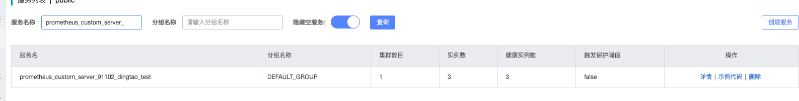

# OzHera自定义打点监控文档

加粗的**重要**内容较为关键，请仔细阅读。

## 一、下载、编译

下载开源代码：

https://github.com/XiaoMi/ozhera/tree/master/prometheus-starter-all

编译成功之后，将pom推送到公司Maven仓库，或引用本地Maven仓库进行调试。

## 二、依赖环境变量

`mione.app.name`：用于记录应用id与应用名称，格式是appId-appName。eg：1-test，1是appId，test是appName。如果为空，程序里默认使用none。应用是OzHera中非常重要的元数据，可观测数据展示都与应用有关。

`TESLA_HOST`：用于记录当前物理机IP，展示在trace的process.tags里。在k8s里获取的是pod的IP。

`PROMETHEUS_PORT`：用于暴露Prometheus拉取指标的HttpServer端口号，默认暴露5555。

## 三、引入pom

```xml
    <dependency>
      <groupId>run.mone</groupId>
      <artifactId>prometheus-diy-starter</artifactId>
      <version>0.0.1-SNAPSHOT</version>
    </dependency>
```

**重要！！！**

1. 自定义打点数据 不要记录traceId、timestamp这种不可枚举的值 如果这种数据打多了会有性能问题

2. 项目初始化阶段，直接调用PrometheusConfigure.init(nacosAddr, serverType)方法，进行初始化。

    `nacosAddr`：nacos地址，ip:port
    
    `serverType`：staging 或者 online，用于生成指标名称的前缀
    
    只要是在进行打点前完成初始化PrometheusConfigure.init()方法的调用即可。
    
    ```java
    import com.xiaomi.mione.prometheus.starter.all.config.PrometheusConfigure;
    
    PrometheusConfigure.init(nacosAddr, serverType);
    ```

    例如：
    
    
    
    服务启动后，在nacos服务列表里搜索prometheus_custom_server_${项目id}_${项目名称}，如果能搜到，表示注册nacos成功。**注意**：搜索时，${项目名称}中的中划线都要改为下划线
    
    例如：
    
    

3. 打点的时候指标名称不要有中文、中划线、反斜杠、点符号等特殊字符，会造成非法指标名。

## 四、自定义打点示例

上述pom中OzHera团队封装了三种prometheus的数据类型，分别是count、Gauge、Histogram，基本能够满足业务自定义打点的需要。

### 1、Counter

#### 1）简介

Counter：只增不减的计数器，我们可以在应用程序中记录某些事件发生的次数，通过以时序的形式存储这些数据，我们可以轻松的了解该事件产生速率的变化，例如可以用来展示QPS，错误计数等。

#### 2）代码示例

```java
import com.xiaomi.youpin.prometheus.all.client.Metrics;

Metrics.getInstance().newCounter("testCounter","methodName","url").with("ok","/test/ok").add(1, "ok","/test/ok");
```

其中"testCounter"是指标名，"methodName"与"url"是标签名，"ok"与"/test/ok"是对应的标签值，add(1)将该指标数据记录一次

### 2、Gauge

#### 1）简介

Gauge：可增可减的仪表盘。

与Counter不同，Gauge类型的指标侧重于反应系统的当前状态。因此这类指标的样本数据可增可减，可用于cpu当前使用率，磁盘目前使用率等标量。

#### 2）代码示例

```java
Metrics.getInstance().newGauge("testGauge","methodName","url").with("gauge","/test/gauge").set(12, "gauge","/test/gauge")
```

其中"testGauge"是指标名，"methodName"与"url"是标签名，"gauge"与"/test/gauge"是对应的标签值，set(12)将该指标的值设置为12。

### 3、Histogram

#### 1）简介

Histogram：分析数据分布情况。

除了Counter和Gauge类型的监控指标以外，OzHera团队还封装了Histogram的指标类型，在大多数情况下人们都倾向于使用某些量化指标的平均值，例如CPU的平均使用率、页面的平均响应时间。这种方式的问题很明显，以系统API调用的平均响应时间为例：如果大多数API请求都维持在100ms的响应时间范围内，而个别请求的响应时间需要5s，那么就会导致某些WEB页面的响应时间落到中位数的情况，而这种现象被称为长尾问题。通过Histogram，可以快速了解监控样本的分布情况。

#### 2）代码示例

```java
double[] buckets = new double[]{0.01, 0.1, 1.0, 5.0, 10.0, 20.0, 40.0, 80.0, 200.0, 300.0, 400.0, 600.0, 800.0, 1000.0,2000.0,3000.0};

long begin = System.currentTimeMillis();

// 你的业务代码
long now = System.currentTimeMillis();

Metrics.getInstance().newHistogram("testHistogram", buckets, "methodName","url").with("histogram","/test/histogram").observe(now-begin, "histogram","/test/histogram");
```

首先要创建一个数据分布的”桶“，例子中的为耗时桶，"testHistogram"为指标名，"methodName"与"url"是标签名，"histogram"与"/test/histogram"是对应的标签值，observe()函数可以简单理解为落入桶中的值。例如：now-begin=11  ,则会落入"10.0 ~ 20.0"对应的桶中。

## 五、验证

引入上面的pom会自动开启一个simpleHttpServer，默认开启5555端口，通过设置环境变量PROMETHEUS_PORT来自定义。项目本地启动后，可以搜索start pormetheus server，看启动日志是否启动成功。


成功后，根据自己打点的方式，造一些打点数据（例如访问一次http接口就打一次点），然后访问localhost:5555/metrics 进行验证。


本地验证成功后，发布到测试或者线上之后，可以先在prometheus dashboard上查询自己的指标，验证指标是否正常。

指标名称结构为：

`${serverType}_${appName}_${自定义指标名称}`

`${serverType}`：是调用PrometheusConfigure.init(nacosAddr, serverType);方法时，入参serverType的值

`${appName}`：是环境变量mione.app.name将中划线改为下划线的值

`${自定义指标名称}`：是在进行自定义打点时，调用Metrics.getInstance().newHistogram、Metrics.getInstance().newCounter、Metrics.getInstance().newGauge的第一个入参。如果是Counter类型，后面需要加上_total；如果是Histogram类型，后面需要加上_bucket

例如：


## 六、配置grafana图表

在OzHera的Dashboard页面上，右侧有一个自定义监控大盘，点击后会默认跳转到这个服务对应的grafana监控页面。


将目录都合上之后，在最下方有一个自定义指标目录，请在该目录下，创建自定义的监控图表。


在自定义的监控图表中，请先选择OzHera的Prometheus数据源，并填入你自己的promql语句。


关于更多grafana监控图表的使用方法，见：https://grafana.com/docs/grafana/v9.2/panels-visualizations/

**（重要！！！！！！忽略可能会在日后将你创建的图表删除）**

1. 在grafana中，OzHera为业务生成了若干内置图表，包括http、dubbo、jvm、db、redis等，业务自定义指标一定要编辑在自定义指标中，因为以后内置图表可能会更新，如果你的图表在其他地方可能会被覆盖掉。

   自定义打点的PromQl语法，可以参考以下文档。
   
   官网文档：https://prometheus.io/docs/prometheus/latest/querying/functions/
   
   prometheus-book:  https://yunlzheng.gitbook.io/prometheus-book/parti-prometheus-ji-chu/promql/prometheus-query-language