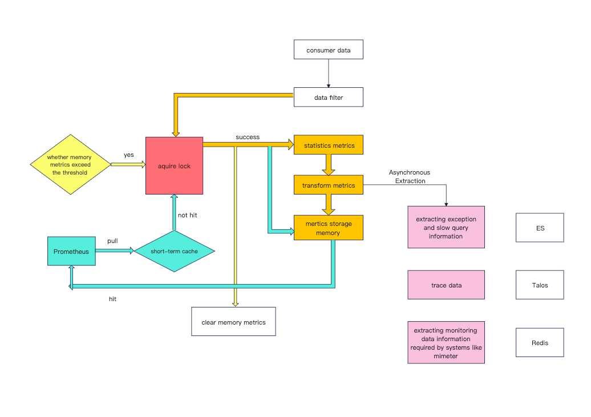

# OzHera Metric Service Optimization

## I. Optimization Results

1. `trace-etl-server` instance count reduced from 200 to a minimum of 20, with a regular presence of 30.

2. With a single-instance configuration of 2C7G, resource utilization, especially CPU usage, increased to 160%-180%.

3. Service throughput increased to a maximum of 60k QPS for trace data processing on a single instance.

4. Feedback from Prometheus maintenance personnel:

   Prometheus vmagent (pre-aggregation service):

   (1) Peak CPU usage dropped from 6.8 cores to 3.8 cores.

   (2) Pre-aggregation metric count decreased by 45%.

   (3) Original metric count decreased by 50%.

5. More reasonable resource utilization. CPU resources are almost entirely occupied by metric calculation logic, even comparable to the resources occupied by thrift serialization and deserialization.

   

## II. Background

### (1) Introduction to the trace-etl-server service

`trace-etl-server` is a service that converts trace data into metrics and is the primary service for OzHera's metric computation. `trace-etl-server` processes all trace data from every application integrated with OzHera. Before the optimization, during the "Double Eleven" promotion period, it was observed to handle a peak flow rate of 1.35M QPS. Apart from transforming traces into metrics, `trace-etl-server` also stores trace IDs of anomalies and slow queries into Elasticsearch (ES) among other operations.

The IP and port of `trace-etl-server` are exposed to Prometheus through `nacos`. Prometheus, every 15 seconds, fetches metric data from each instance of `trace-etl-server`.

After each fetch by Prometheus, the in-memory metric data is cleared.

Here's the architecture diagram of `trace-etl-server` before optimization:



### (2) Identified Issues

#### 1. Insufficient consumption capacity and low service throughput.

As an ETL service, it's required to process vast amounts of data. Prior to optimization, a single instance of `trace-etl-server` could only handle a maximum of over 5,000 QPS. During the promotional periods, tens of millions of messages accumulated, severely impacting the real-time nature and accuracy of the metrics.

#### 2. Excessive resource consumption by the service.

Due to the low throughput, scaling out was necessary to meet the requirements of the promotional events. Before optimization, the number of `trace-etl-server` instances reached 240 during promotional periods, and 200 instances during non-promotional times.

#### 3. Severe wastage of service resources.

Despite deploying so many instances, the CPU utilization rate for a single instance was only about 10%, meaning 90% of the CPU resources were idle. The configuration for a single instance before optimization was 2C4G.

#### 4. The service experienced memory overflow issues.

Due to the absence of effective memory management (the logic to clear memory metrics when exceeding a threshold hadn't been implemented), the service faced Out Of Memory (OOM) issues during promotional periods.

#### 5. High metric aggregation computational pressure on Prometheus.

Before the optimization, the trace data from all applications were randomly distributed across 200 instances, meaning metrics from a single application could appear across all 200 instances. Since these data points were dispersedly stored in Prometheus (with internal metric tags, such as the instance tag which combines the IP and port of `trace-etl-server`), a significant amount of aggregation computation was required during queries, leading to exceptionally slow query speeds. Although the pre-aggregation capabilities of VictoriaMetrics were employed to enhance query speeds, this pre-aggregation also consumed substantial resources.

## III. Optimization Objectives

(1) Reduce the number of service instances. The anticipated goal is to decrease from 200 instances during non-promotional periods to 30 instances.

(2) Enhance the service throughput to meet the requirements set out in Objective 1.

(3) Improve the service resource utilization, especially the CPU usage rate.

(4) Eliminate Out Of Memory (OOM) issues.

## IV. Optimization Strategy

### (1) Migrate Metric Calculation to the Probe

Remove the centralized metric calculation service (trace-etl-server) and implement the metric calculation logic within the probe (opentelemetry-java-instrumentation). This way, every instance of every business application will expose its own business metrics.

#### Advantages:

1. Address the issues of resource usage, resource wastage, and low throughput in the centralized trace-etl-server metric calculation.

2. Resolve the issue of Prometheus requiring metric aggregation.

3. The metric service doesn't need to adopt a pull-delete mode, thus calculations in promQL like sum_over_time can be omitted, enhancing chart display speed.

#### Disadvantages:

1. Difficulty in adapting to multiple languages. If the metric calculation logic is placed on the business side, it necessitates multi-language adaptation.

2. Significant impact on business. Increased storage and exposure of business metrics impose high-quality requirements on the code quality within the probe, presenting increased risks.

3. Slow change rate; changes require business applications to release a new version to update the probe. Consequently, if issues arise, they can't be instantly and comprehensively rolled back; it requires releasing a new version of the business application.

### (2) Optimize trace-etl-server

The optimization of the trace-etl-server primarily focuses on reducing lock contention times, reducing the granularity of locks, enhancing CPU utilization, accelerating consumption rate, and increasing throughput per instance, consequently reducing the number of service instances. Additionally, it's essential to control the number of metrics in memory to prevent memory overflows due to excessive metrics. Also, there's a need to consider reducing the workload of Prometheus in metric aggregation calculations.

#### Advantages:

1. Retains the existing architecture, causing no intrusion or perception from the business side.
2. Strong adaptability to multiple languages.
3. Quick change speed, only requiring a release of the trace-etl-server.

#### Disadvantages:

1. Necessitates code optimization and refactoring, demanding high standards for concurrent processing code.

**Considering the requirement for multi-language adaptability in open source, the decision was made to proceed with optimizing the trace-etl-server strategy.**

## V. Optimization Process

### (1) Root Cause Analysis

#### 1. Why is the consumption rate slow, throughput low, and too many instances occupied?

(1) Extended lock blocking time

To ensure the accuracy of the metrics fetched by Prometheus, both fetching metrics by Prometheus and data consumption by trace-etl-server would contend for the same lock. As the pre-optimized data consumption was single-threaded and the lock was reentrant, the performance bottleneck would appear when Prometheus fetched metrics, blocking the consumption thread.

Following this line of thought, the time taken by Prometheus to fetch metrics was printed. Normally, the duration is within 500ms, but during peak times, it can rise to about 2s. Why does it take so long? When Prometheus fetches metrics, it traverses all the metrics in memory, converting them into the Prometheus metric data format to return to Prometheus. As memory metrics increase, this traversal count can escalate from tens or hundreds of thousands to millions. Using Arthas's trace command, we observed that as memory metrics increased, a method inside the Prometheus metric fetching procedure would be executed millions of times, accounting for the 2-second duration.


Although Prometheus requests are sent every 15 seconds, imagine that during peak times, the consumption thread is blocked for 2 seconds every 15 seconds. This will undoubtedly reduce the overall consumption rate and throughput.

#### 2. Why is resource utilization, especially CPU usage, so low?

(1) Choice of consumption model

Firstly, trace-etl-server's consumption internally uses a message queue developed by Xiaomi named Talos (open-sourced as RocketMQ), which is similar to Kafka and employs the concept of partitions. A partition and consumer have either a one-to-one or many-to-one relationship. To avoid concurrency issues, a one-to-one consumption model was previously selected, meaning one trace-etl-server instance could only consume data from one partition. Furthermore, extended lock blocking times, resulting in lower service throughput, means that a single trace-etl-server instance lacks the capability to consume data from multiple partitions.

#### 3. Why is there memory overflow?

(1) Excessive number of metrics in memory

Before optimization, there was no filtering or categorization of trace data from applications, leading to the trace data of the same application being consumed by one or a few partition instances. Thus, in theory, every trace-etl-server instance could consume trace data from all applications, converting them into metrics. This meant every trace-etl-server instance held a full set of application metric data, causing the persistent high number of metrics in memory.

#### 4. Why is the metric aggregation pressure on Prometheus so high?

(1) Scattered metric data

Before optimization, metric data of an application was dispersed across different trace-etl-server instances (in theory, under extreme conditions, across all instances). When Prometheus fetches metrics, it attaches an instance tag, i.e., the IP and port of the trace-etl-server. This means that even if it's the same metric with the same label, Prometheus views them as different. Currently, almost all business metrics in OzHera require aggregation by application. So, when Grafana queries Prometheus, Prometheus actually has to perform a significant amount of aggregation operations. This not only increases the load on Prometheus but also significantly slows down the query speed for OzHera users, especially when viewing P99 charts.

### (2) Optimization Steps

#### 1. Lock Optimization

We already know that the long duration taken by Prometheus for fetching leads to extended blockage of the consumption thread. The solution is to reduce the lock blockage duration. Here, two Metrics objects were used to store in-memory metrics. Every 15 seconds, the object currently recording the metrics would be swapped. This means the lock only needs to be applied during the object swapping process, which is essentially the process of changing variable pointers. As a result, the lock blockage time is minimal and can be considered negligible.

Firstly, the previous singleton Metrics class was modified to support multiple instances. Furthermore, each instance's internal Collector (the class genuinely used for storing metric data) is also individually created.

The code for changing metric objects is as follows:

```java
/**
 *
 * Switch Metrics objects every 15 seconds
 */
Executors.newSingleThreadScheduledExecutor().scheduleAtFixedRate(() -> {
    // Start caching only after Prometheus fetches the data. This is to prevent scenarios where, 
    // upon service start, Prometheus takes time to detect and results in excessive data in cacheData. 
    // There's a risk that metrics might get cleared.
    if (startCache) {
        try {
            Stopwatch sw = Stopwatch.createStarted();
            // Acquire lock
            enterManager.getMonitor().enter();
            log.info("begin change");
    
            try {
                // Here, we wait for the current metric conversion request to be completed to avoid 
                // potential metric omissions or losses.
                while (enterManager.getProcessNum().get() > 0) {
                TimeUnit.MILLISECONDS.sleep(200);
                }
                // Logic to switch the Metric object
                call.change();
            } catch (Throwable ex) {
                log.error(ex.getMessage(), ex);
            } finally {
                // Release the lock
                enterManager.getMonitor().leave();
                log.info("change use time:{}ms", sw.elapsed(TimeUnit.MILLISECONDS));
            }
            // Convert data inside the Metric object asynchronously into the format Prometheus fetches, 
            // transform into byte[], and store it in the cache. When Prometheus fetches, it reads data 
            // directly from the cache, reducing Prometheus's fetching time.
            cacheData();
        } catch (Throwable t) {
        log.error("schedule cache data error : ", t);
        }
    }
}, 0, 15, TimeUnit.SECONDS);


```

Consumer thread code:

```java
@Override
public void process(List<MessageAndOffset> messages, MessageCheckpointer messageCheckpointer) {
    // Cleverly acquire and immediately release the lock here to prevent blocking between consumer threads.
    // When metric object starts to change, it also serves the purpose of blocking the consumer thread.
    enterManager.enter();

    // Use a counter here to indicate that a consumer thread is currently calculating metrics, 
    // so metric object changes cannot be made.
    enterManager.getProcessNum().incrementAndGet();

    try{
    
        // Metric calculation logic....

    } catch (Throwable throwable) {
        log.error("process error, ", throwable);
    } finally {
        // This indicates that the consumer thread metric calculation is complete and metric object changes can be made.
        enterManager.getProcessNum().decrementAndGet();
    }
}

```

#### 2. Control the Number of Metrics in Memory
By controlling the number in `cacheData`, we prevent having too many metrics in memory due to Prometheus not pulling for a long time.

#### 3. Initial Deployment
By controlling the granularity of locks and reducing the lock blockage time, after the first online deployment, the number of `trace-etl-server` instances was reduced from 200 to 100. When it was reduced to 80, OOM began to occur. Analysis revealed that each instance basically stored metric data for all applications, which is a huge amount of data.

#### 4. Categorize Trace Messages by Application Name
Following the previous analysis, the data needs to be categorized by application. This means that the trace data of an application is hashed by the application name so that the trace data of the same application is only distributed on two partitions. This significantly reduces the number of metrics on each `trace-etl-server` instance. With this idea in mind, `log-agent` was modified. Using the `partitionKey` feature of Talos (open-sourced as RocketMQ), when constructing the Talos Message object, the `partitionKey` was set to the application name, and random strings were added before and after the application name. In fact, Talos internally will also use the `partitionKey`, hash it based on the current topic partition number, and determine which partition should process the current message.

#### 5. Second Deployment
After this change was deployed, there were issues of message accumulation on some partitions with only 200 instances.

#### 6. Identify Hotspot Applications
A metric exposed by `trace-etl-server` indicates the number of data entries processed by the current instance, which can be grouped by business application. Firstly, on the Talos (open-sourced as RocketMQ) monitor, the `trace-etl-server` corresponding to the partitions with accumulated messages were identified. Then, by querying these `trace-etl-server` instance metrics for application distribution in the Prometheus background, it was found that these instances, coincidentally, had a very high data volume from some "hotspot applications". This suggests that applications with a very high volume of trace data were allocated to these `trace-etl-server` instances, resulting in the `trace-etl-server` not being able to consume them, leading to message accumulation.


However, it was also observed that the CPUs of these `trace-etl-server` instances with accumulated messages weren't fully utilized, indicating that they hadn't reached their performance limits.

#### 7. Adjust Talos Parameters and Identify Talos as the Bottleneck
After noticing the CPUs weren't maxed out, the idea was to adjust Talos's consumer-side parameters to increase the pull volume of individual batch messages and reduce the interval between batches, thus enhancing the consumption capability of `trace-etl-server`. However, it was found that on the consumer side, Talos has restrictions for these parameters. The maximum number of messages per batch is 5000, and the minimum pull interval between batches is 50ms.

From this perspective, each Talos consumer instance should have a maximum message processing rate of 10W QPS. However, due to various overheads, it can't reach this rate.

#### 8. Adjust Hotspot Applications
Since adjusting Talos parameters wasn't a solution, the only way was to hash the trace data of these hotspot applications onto more partitions, which requires modification of `log-agent` to configure the partition number for these hotspot applications.

#### 9. Third Deployment
By adjusting the partition number for synchronization applications, we successfully reduced the number of `trace-etl-server` instances to 50. At the same time, we were curious about why these applications produced so much trace data.

#### 10. Investigate the Cause of Hotspot Applications
Firstly, the trace data stored in ES will record the operation name (`operationName`) of this span and which framework produced it. Then, using Kibina's data analytics, we found the operation ratio of these hotspot applications and discovered they were Redis commands, with some applications having Redis spans accounting for 90% of all their spans.


By examining some of the applications using Redis and checking the interception code for Lettuce and Jedis in `opentelemetry-java-instrumentation`, no anomalies were found.

In versions after lettuce 5.1, it provides a trace extension. In `opentelemetry-java-instrumentation`, the Tracing interface for lettuce is implemented.

For Jedis, `opentelemetry-java-instrumentation` directly intercepts the `sendCommand` method.

We suspect that on the business side, in the Redis cluster mode, all batch operations are actually sent one by one.

#### 11. Filter Some Redis Command Requests in the Probe

We examined the links that included these types of Redis requests and found that their link nodes basically looked incomprehensible. For example:


With a screen full of Redis operations, you can't see the exceptions or slow query nodes at all. So, we believe that such a large number of Redis nodes, without any exceptions or slow queries, are a disaster for business troubleshooting.

Therefore, we modified the Lettuce and Jedis instrumentation in `opentelemetry-java-instrumentation`, filtering out some of the excessive Redis operations in hotspot applications. If this node is not an exception, we will no longer generate a span.

#### 12. Use JDK20

Coroutines in JDK20 are lighter than Java threads. For I/O intensive services, using coroutines can essentially make the service throughput not limited by threads. ZGC can improve GC efficiency and reduce STW time.

## VI. Suggestions for Further Optimization

1. Since `trace-etl-server` currently consumes in multiple threads, a read-write lock can be used instead of `ReentrantLock`, reducing the lock competition consumption between consumption threads.

2. The current `HttpServer` that receives Prometheus pulls uses the JDK's built-in `HttpServer`. This can be changed to use the HTTP service provided by SpringBoot, using the built-in Tomcat or Jetty, which is more secure and stable.

3. When changing the Metric object, if it is found that there is currently a thread performing metric calculation, it will wait for 200ms for the metric calculation thread to complete. This 200ms can be appropriately reduced.

4. Abstract and refactor the entire `trace-etl` service. The current direction is to use extensions, achieving openness for extensions and closure for modifications.
