# OzHera User Manual

## I. Application Center

### (i) Application Dashboard

#### 1. Application Search

Add to the projects I'm following or the projects I'm involved in (as shown below)

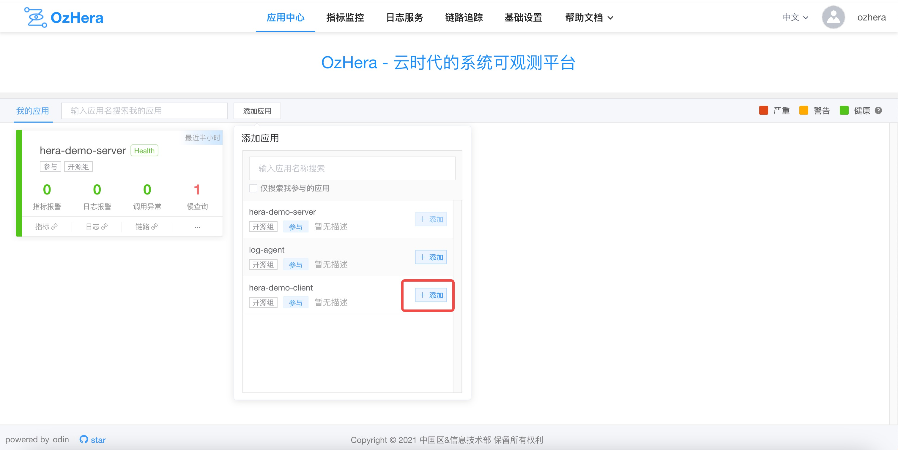

Note: Those marked with participation are projects with permissions on the corresponding platform and can be added to the list of projects I'm involved in. Otherwise, they can be added to the watchlist.

#### 2. Application Observation

You can see the applications I'm involved in and the applications I'm following in the Application Center.


For each project card, you can see statistics of alarms, call anomalies, slow queries, etc., for each project (click for details; later tutorials will explain the details page).

## II. Metrics Monitoring

### (i) Metrics Monitoring

### 1. Dashboard

#### 1) Basic Monitoring

Within the dashboard, the main sections are divided into basic monitoring charts and custom charts. Basic monitoring includes application health charts, business metrics charts, middleware charts, JVM charts, and so on.

##### (1) Application Health

After selecting the desired application (with further options to select environment, IP, and time range), you can view the charts on availability, instance list, and call volume. Additionally, links are provided to view more detailed monitoring of the host and container, as shown below:


##### (2) Business Metrics

Business metrics provide charts on QPS, P99-RT, AVG-RT, and TOP10-RT for three types of calls: HTTP, dubbo outgoing (acting as a consumer), and dubbo incoming (acting as a provider).


##### (3) Middleware

Middleware charts currently provide P99-RT, AVG-RT, TOP10-RT, and TOP10-query for both DB and Redis, as shown below:


##### (4) JVM

JVM monitoring charts offer multi-dimensional metrics for user reference, as shown below:


#### 2) Custom Charts

Custom charts allow users to submit their own Prometheus data and configure their own viewing charts. Users should be familiar with PromQL and Grafana template configurations.

For a more detailed description and usage of custom charts, refer to: [OzHera Custom Monitoring Documentation](..%2Fcustom-tracking%2Fcustom-tracking.md)

### 2. Overview of Call Anomalies

#### 1) Anomaly List


Note: Overview includes HTTP call anomaly list, dubbo call anomaly list, and DB call anomaly list (example above shows HTTP).

#### 2) Anomaly Details


Note: Clicking on details in the image above will navigate to a page showing basic anomaly information, **call trace**, and **logs**.

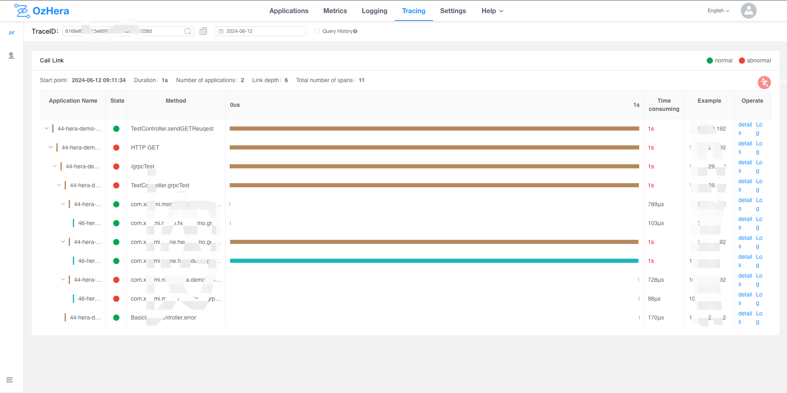

### 3. Overview of Slow Queries

#### 1) Slow Query List


#### 2) Slow Query Details


Clicking on details, as shown above, will reveal slow call information and **call trace**.

### 4. Interface Overview

Within Hera monitoring, clicking on the interface overview reveals the monitoring charts shown below, divided into Dubbo Provider Interface Overview, Dubbo Provider Interface, Dubbo Consumer Interface Overview, Dubbo Consumer Interface, HTTP Server Interface Overview, and HTTP Server Interface.

Charts with the "overview" suffix are organized in a table format, with aggregated views of all services, views at the Dubbo service level, and views at the Dubbo method level.


Charts with the "interface" suffix are in chart form, and users can select multiple Dubbo services to view.


### 5. Project Overview List

The original intention of designing the project dashboard was to meet the needs of users to view aggregated information from multiple services. For instance, a team leader might be interested in the overall stability of all services within the team, or during major promotions, some important services might be added to the project dashboard for focused monitoring, and other similar needs.

As shown below, several services can be added to the application package.


Once created, the dashboard will appear in the list. Clicking on the dashboard button under operations will navigate to the dashboard monitoring.

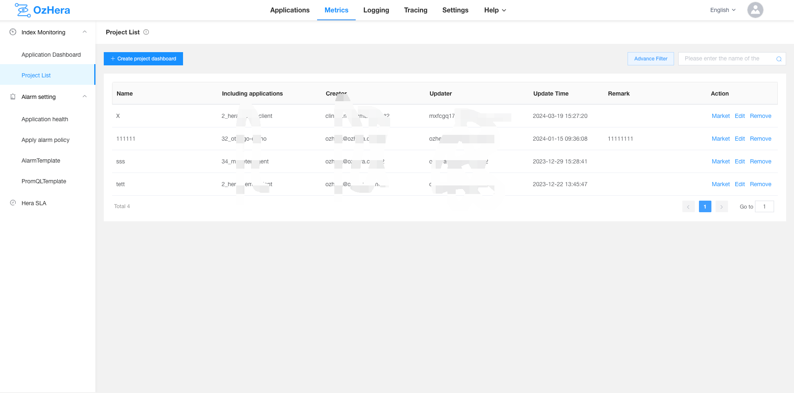

Within the dashboard, one can view important information from multiple services like DB, HTTP, dubbo, redis, load, etc. Clicking on the application name in the application list below will quickly navigate to the detailed monitoring page for that service.


### 6. Resource Utilization Overview List

The resource utilization dashboard allows users to quickly view related monitoring charts of a service deployment. Different from container monitoring charts, this chart provides an aggregated view of monitoring information across multiple instances of a service, making it easy to get a comprehensive view of the service's overall deployment resources, as shown below:


### (ii) Alarm Settings

### 1. Application Alarm Strategy

**Preface**:

The application alarm strategy is designed to categorize alarms better. With an alarm strategy, we can better segment alarm rules, grouping similar alarm rules into a single strategy. This makes maintenance more convenient and improves operational efficiency.

**Terminology**:

Alarm Rule: Refers to a single alarm configuration.

Alarm Strategy: Represents a set of alarm rules. It's used for better classification, management, and maintenance of alarm rules.

**Relationships**:

One application can be configured with multiple alarm strategies. Under one alarm strategy, multiple alarm rules can be set.

#### 1) Alarm Strategy List

First, click on the "Application Alarm Strategy" option from the left menu. On the right, the alarm strategy list page will open. The alarm strategy list page allows you to filter and search for alarm strategies based on application name, strategy name, and monitoring type (basic metrics, interface metrics, custom promql).

On the alarm strategy list page, you can start/stop, copy, edit, and delete alarm strategies.


Note: Project participants can search, add, copy, modify, and delete rules. **Observers can only view rules and cannot copy, modify, or delete them.**

#### 2) Alarm Strategy Creation

Click the "New" button at the top left of the alarm strategy list to enter the alarm strategy creation page where you can fill in the relevant alarm strategy details.

First, select the application for which you wish to create an alarm strategy, then fill in the required fields:

Strategy name, alarm rules (metrics, operation, threshold, duration, alarm level, alarm frequency), notify personnel, and @personnel list. Once completed, click the confirm button below to finalize the creation of the alarm strategy.


Note: Only projects with permission (listed under "Applications I'm involved in") can create strategies.

#### 3) Alarm Strategy Categories

Overall, alarm strategies are divided into three categories:

    Basic metric alarms: Monitor hardware-related metrics.
    
    Interface metric alarms: Monitor business-related interface metrics.
    
    Custom metric alarms: User-defined PromQL alarm configurations.

**Attention**: These three alarm rule types cannot be mixed and matched in a single alarm strategy. One strategy can only configure one type of alarm rule.

##### (1) Basic Monitoring

The basic alarm strategy pertains to the metrics related to the hardware environment in which the application operates, such as CPU, memory, load, and JVM-related metrics:

    k8s container CPU usage: CPU usage (average) in the last 1 minute > threshold
    
    k8s container load: Load (average) in the last 1 minute > threshold
    
    k8s container memory usage: Memory average usage in the last 1 minute > threshold
    
    k8s container count: Number of containers reporting their status in the last 5 minutes < threshold (can be used to monitor container crash alarms)
    
    k8s container CPU resource utilization (1d): CPU resource utilization over a day (24h), can be used to observe if resource usage efficiency is too low
    
    k8s container memory resource utilization (1d): Memory resource utilization over a day (24h), can be used to observe if memory usage efficiency is too low
    
    HeapUsed: Heap memory usage, JVM heap memory average usage in the last 1 minute > threshold
    
    NO-HeapUsed: JVM non-heap memory average usage in the last 1 minute > threshold
    
    Thread count: Number of threads in the last 1 minute > threshold
    
    GC counts: Number of Garbage Collection occurrences in the last 1 minute > threshold
    
    GC duration: Duration of a particular GC in the last 1 minute > threshold
    
    FullGC counts: Number of Full Garbage Collection occurrences in the last 1 minute > threshold
    
    FullGC duration: Duration of a particular FullGC in the last 1 minute > threshold

##### (2) Interface Monitoring

The interface alarm strategy mainly deals with business-related metric alarms, such as HTTP, httpClient, dubbo, db (currently only MySQL), etc.

**http**:

    http/httpClient exception count: Number of interface call anomalies in the last 30 seconds (where httpCode!=200).
    
    http/httpClient availability: In the last 30 seconds, the number of successful interface calls divided by the total number of interface calls (30-second availability rate).
    
    http_qps/httpClient_qps: Number of interface calls in the most recent seconds divided by 30 seconds (30-second average QPS).
    
    http/httpClient average response time: Total duration of a particular interface in the last 30 seconds divided by the total number of calls (30-second average response time).

**dubbo**:

    dubboProvider/dubboConsumer exception count: Number of interface call anomalies in the last 30 seconds (when the interface throws an exception).
    
    dubboProvider/dubboConsumer availability (provider): In the last 30 seconds, the number of successful interface calls divided by the total number of interface calls (30-second availability rate).
    
    dubboProvider/dubboConsumer_qps: Number of interface calls in the last 30 seconds divided by 30 seconds (30-second average QPS).
    
    dubboProvider/dubboConsumer average response time: Total duration of a particular interface in the last 30 seconds divided by the total number of calls (30-second average response time).
    
    dubbo slow queries: Number of slow calls for a particular interface in the last 30 seconds (if the duration exceeds 1 second, can be configured later).

**db**:

    db exception count: Number of interface call anomalies in the last 30 seconds (db call anomalies).
    
    db availability: In the last 30 seconds, the number of successful interface calls divided by the total number of interface calls (30-second availability rate).
    
    db slow queries: Number of slow calls for a particular interface in the last 30 seconds (if the duration exceeds 1 second, can be adjusted later).


##### (3) Custom PromQL

For self-defined metrics, you'll need to manually write a PromQL configuration for the alarm. The configuration location is:


After filling it out, you can click the link in the bottom right to test your PromQL:


## III. Tracing

### (i) Tracing Query Interface

### 1. Main Page Chart

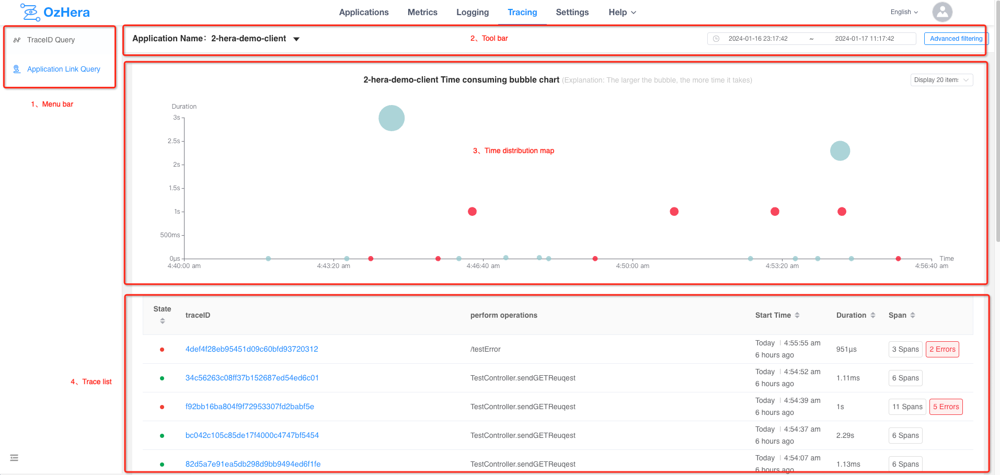

#### 1) Menu Bar

Used to switch between trace list queries and traceID detail query pages.

#### 2) Top Toolbar

You can enter an application name to search. Clicking on "Advanced Filter" will open a multi-condition query box:


    You can search by start time and end time.
    
    You can search by Tag.
    
    You can search by application operations (interface name, method name, db statement, etc.).
    
    You can search by tag. For example: http.status_code=500, indicating traces with an HTTP return status of 500; error=true indicates traces containing error information, and so on...
    
    You can search within a duration range.

#### 3) Duration Distribution Chart

You can get an intuitive view of the duration distribution of the currently queried traces. Traces containing errors are highlighted in bright red.

#### 4) trace List

    "Status": displays whether the current trace contains errors. If it does, it will be shown in red.
    
    "traceID": clicking on it will navigate to the trace details page.
    
    "Executed Operation": displays the root node span's interface name, method name, or db statement, etc.
    
    "Start Time": shows the start time of the current trace.
    
    "Duration": displays the duration of the current trace.
    
    "Span": shows how many spans the current trace has in total.

### 2. trace Details

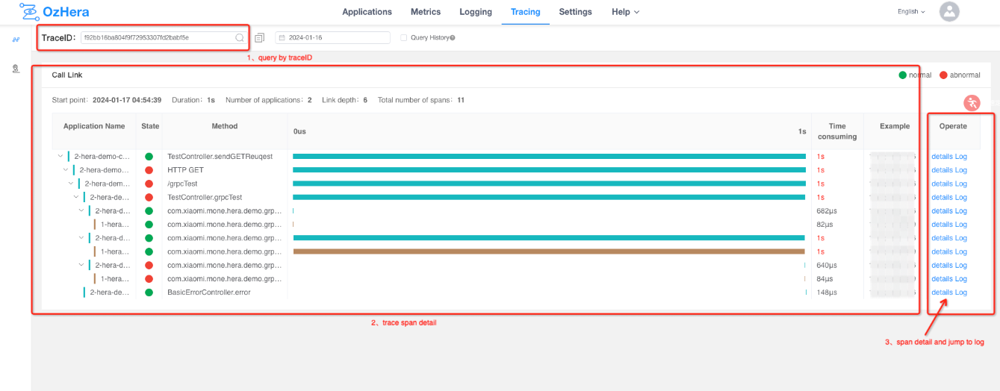

#### 1) traceID Search Box

You can search by traceID.

#### 2) trace Node Dashboard

Displays application name, status, method, duration, current node instance IP, and other information.

#### 3) Span Information

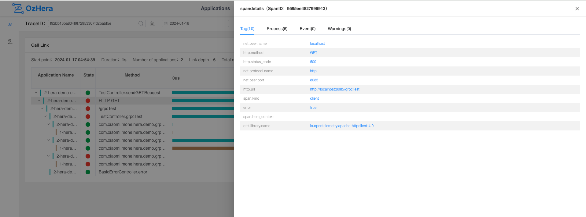

    Tags: Displays the current node's tags, such as HTTP status, RPC info, db info, etc.
    
    Process: Shows current node IP, hostname, application name, etc.
    
    Log: Displays information recorded by the probe on the current node, such as error stack log, business status code, dubbo input and output data, etc.
    
    Warnings: Shows warning information of the current node on the trace link, such as time discrepancies caused by inconsistent server clocks, incomplete node information due to lost parent node data, etc.

### (ii) Additional Capabilities of Tracing

### 1. Custom trace (Method Level)

1. Javaagent probe added.

2. Introduce to pom:

    ```xml
        <dependency>
            <groupId>run.mone</groupId>
            <artifactId>hera-trace</artifactId>
            <version>1.4.0</version>
        </dependency>
    ```
3. Add the @Trace annotation from the com.xiaomi.hera.trace.annotation package to methods where custom trace is needed, e.g.:


### 2. HeraContext - Custom Tracing Context

Often, we wish to pass some information throughout the entire trace, similar to how traceID can connect the entire trace. HeraContext offers a capability akin to passing traceID, allowing information to be set at a span within the trace, which will then be propagated throughout the call trace.
Usage:

1. Added a javaagent probe.

2. Introduced to pom:

    ```xml
        <dependency>
          <groupId>run.mone</groupId>
          <artifactId>hera-trace</artifactId>
          <version>1.4.0</version>
        </dependency>
    ```

3. In Java code, use the `getContext`, `get`, and `set` methods provided by the `HeraContextUtil` class to store and retrieve values.

    - The `getContext()` method returns a Map where the key is always "heracontext", and the value is the context content stored under the current node in the current link.
    - The `get(String key)` method retrieves the value based on the Context key.
    - The `set(String key, String value)` method stores the key-value pair in the current link context and propagates it downstream.

4. Passing Context in the Frontend:
   Add a key named "heracontext" to the HTTP request header, with values formatted as "key1:value1;key2:value2;...". For example:

    

5. Restrictions on using HeraContext:

   (1) For the sake of downstream service performance, within a single link, HeraContext can store a maximum of 8 key-value pairs. If the key-value pairs in the HeraContext of the current node already number 8, then the `set` method will not be able to store any more.

### 3. Retrieving traceID and spanID

1. Added a javaagent probe.

2. Included in pom:

    ```xml
        <dependency>
          <groupId>run.mone</groupId>
          <artifactId>hera-trace</artifactId>
          <version>1.4.0</version>
        </dependency>
    ```

3. In Java code, use the methods `traceId` and `spanId` provided by the `TraceIdUtil` class for retrieval.

## IV. Logging Service

### i. Relevant Concepts

### 1. Space

Space is a resource management unit in the logging service, used for resource isolation and control.

#### 1) Creation

Spaces can be created under Logging Service -> Log Ingestion:

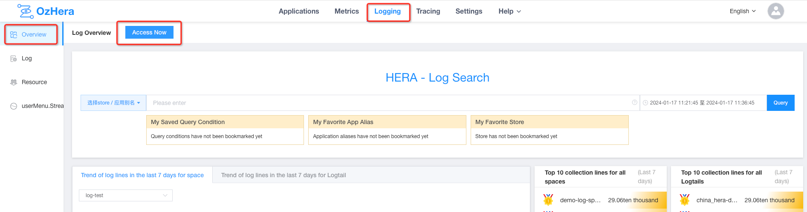


#### 2) Authorization

After creating a Space, by default, it is only visible to its creator. To authorize others to view it, click "Authorize" in Logging Service -> Log Ingestion -> Space List, and then proceed to the Mi-TPC system for authorization:

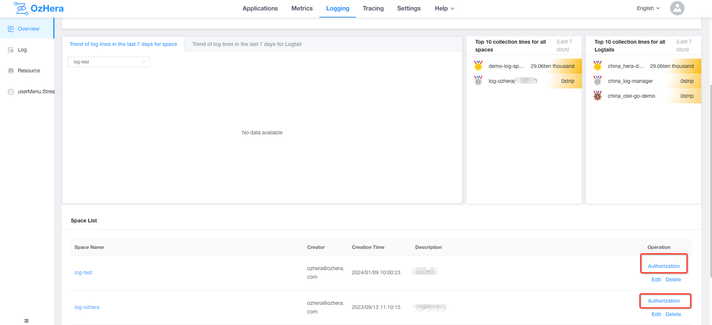

Permission notes:

1. In theory, a Space you created is only visible to you.

2. If I am an administrator, meaning I am an administrator of a node in TPC logger or an administrator of the parent node of logger, I can see the Spaces created by others.

3. For a Space I created, I can add members in the member tab of this space's name node in TPC. After that, others can also see it.

### 2. Logstore

A Logstore is a collection of logs of the same type, and it doesn't support mixing different types.

For Hera log:
1. Logstore is the unit for collecting, storing, and querying log data.
2. A Logstore contains a collection of logs of the same type. The field set configured in a Logstore must be the union of log fields from all Logtail configurations under it.

### 3. Logtail

Logtail refers to a log instance.

For Hera log:
1. Logtail corresponds to the collection of logs from each integrated instance and its environment.
2. In different Logtail configurations under a single Logstore, the meaning of each log field should be the same, though their order might differ.

### i. Integration and Usage

### 1. Integrate Applications into the Hera Platform

First, you need to go to the Hera node in the TPC platform to add a new node:

    Node type: Project,
    Node name: Project name,
    External node type: Project,
    External node ID: This value can be used as a unique ID for future data transmission. If not available, it's recommended to leave it blank.
    Description: A brief description.


### 2. Create a Logstore

Enter the Logstore name, select the data center, and the type of log:


**Detailed Configuration Meaning:**

- Data Center: Currently supports mainland data centers.
- Log Type:
   - Multi-line: Multi-line application logs, opentelemetry logs.
   - Single-line: Single-line application logs, nginx logs, docker logs, custom logs.
     Note: For multi-line application logs, if the line-starting regex isn't specified during Logtail creation, the default is that logs must start with a timestamp, such as 20... or [20...; otherwise, multi-line collection might be abnormal.
- Storage Lifecycle: How long data in the ES index is retained.
   - Currently, the lifecycle of an ES index is specified when creating the index, the default retention is 5 days.
- Number of Storage Shards: This configuration is not currently in use; use the default.
- MQ resource list and ES list: (Visible only to non-admin users. Refer above to understand how to become an admin)
   - Due to resource isolation, non-admin users need to go to the resource management page to add RocketMQ and ES resource information. For details, refer to the resource management guide.
   - Once resources are initialized, you'll see the MQ resource list and ES list. Just select the MQ and ES information you've initialized to complete the integration.
   - If you're an administrator, you won't see these two options. They'll default to selecting the two resource pieces of information created by the administrator.

### 3. Create Logtail


**Configuration Meaning:**

- Application Type: hera
    - Upon selecting different types, options specific to that type will appear. You can fill in or choose based on the actual circumstances.
- Log File Path:
    - Specific to the file name, e.g.: /home/work/log/xmstore-aftersales/server.log.
    - Supports wildcard matching, e.g.: /home/work/log/*.log.
- Split Expression: Naming rules for splitting the log file.
  If the split log is not in the current directory after splitting, and the prefix of the split filename is not named after the log, you need to manually enter the split expression. For example: /home/work/logs/applogs/old/shopapi_application.log-.*. Otherwise, there's no need to fill it in.
- Line Starting Regex: e.g., ^2022-* .*$.
- Log Parsing Type: Delimiter, Custom, Regex, JSON, nginx.
- Parsing Script:
    - Delimiter: Describes how each segment is separated. Input the delimiter that separates your log.
    - Custom: If it's intricate, where each part has a different delimiter, use custom. For instance: [%s]-[%s]-[%s]-[%s]-[%s]-%s. It will search each segment based on %s, identifying each segment's prefix and suffix.
    - Regex: Input a regex. It will extract fields based on capturing groups.
    - nginx: Input nginx log format configuration.

  ```
    log_format milog2  
      '$time_iso8601\t$msec\t$host\t$request_method\t$scheme\t$status\t'
      '$upstream_addr\t$upstream_cache_status\t$upstream_status\t'
      '$server_addr\t$remote_addr\t$http_x_forwarded_for\t'
      '$request_length\t$request_time\t$bytes_sent\t$upstream_response_time\t'
      '$upstream_connect_time\t $upstream_header_time\t$upstream_response_length\t$upstream_bytes_received\t'
      '$request_uri\t"$http_user_agent"\t'
      '$sent_http_x_xiaomi_error_code';
  ```
- Collection rate: The frequency at which logs are sent during collection, controlling the rate of sending.
- Index Column: What each part of the log represents. This is selected from the current store and must correspond to the actual meaning of the fields in the log. The index column of the store must be the most, to avoid missing when selecting with tail.

### 4. Log Query

Supports full-text search of logs, v queries, k:v queries, and combined queries of and, or, not.


Detailed query syntax:
- Keyword query: Directly input keywords for searching
    - Supports exact searches, for instance: "dispatcher" can search any field containing the dispatcher log data (complete match required if the index column type is keyword)
    - Supports tokenized search, for example: test log stream, then tokenized search will be performed
- If the condition is enclosed in double quotes, it only supports phrase prefix match queries for the message field or exact queries for the traceId field. For example, "b24e35ed31cb51e5516e25453228f36d" can search for logs with traceId as the condition, or logs with tokenized message starting with the condition.
- kv query: Enter in key:value format for searching
    - If the value is enclosed in double quotes, then it matches logs where the key starts with the given value
    - Otherwise, it matches logs where the value of the key is the given value
      The above matches: will tokenize the condition and search for each tokenized term

### 5. Interaction with trace

When the parsed log contains a traceId or trace_id field, a "View Trace" tag will be displayed.


### 6. Collection Progress

Here you can see the current log collection application name, collection time, collection path, IP, line number, and collection progress.

From this progress, you can determine whether your logs are being collected properly. Contact us if the collection progress is abnormal for an extended period.


### 7. Log Analysis


You can create a new chart. Selecting fields from the left will group them accordingly. Various types of charts clearly show proportions, assisting in log analysis and processing.

### 8. Log Authorization


Authorize the space you want to display, and the authorized space can also see the current store.

### 9. Resource Isolation

First, resources need to be created.

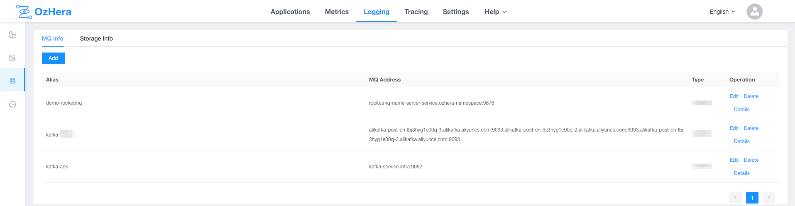

Add RocketMQ resources:


**Configuration meaning:**

- Alias: A unique identifier for your RocketMq information. It's best to make it self-explanatory when creating
- Region: Currently only mainland data centers are available
- mq address: Address where rocketMQ is located
- MQ domain name: If there's no domain name, leave it blank
- ak, sk: RocketMq's secret keys. If not available, leave blank
- brokerName: Name of the RocketMq queue, default is broker-0. If you have customized RocketMQ, this may need to be changed
- Tag list: You can tag the information you create to uniquely identify it

Add ES resources:


**Configuration meaning:**

- Alias: Name your created resources in a descriptive manner
- Region: Choose which region it belongs to
- es cluster name: The name of the es cluster you are using
- esApi address: es address
- Connection method: By default, it is username-password authentication
- Username, Password: Credentials for the ES you are using. If not available, leave blank
- Tag list: Tag your created information to uniquely identify it
- es index group: Users need to pre-create indices and bind them to the respective log types. You can create an index for each type, or multiple types can share an index

If the above 2 pieces of information are not created in advance, when creating the store you will be prompted to initialize this information. Once initialized, select the information you have created.

## V. Basic Settings

### I. Filter Configuration

### 1. Monitoring Metrics Filter Settings

#### 1) Exclude Operation Content

Exclude based on specified operation content, supporting fuzzy matching. The operation content here refers to the methods of each node in the trace details, as shown in the figure below:

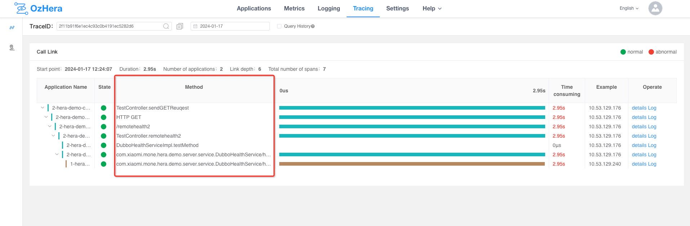

#### 2) Exclude Operation Content (http server)

Sometimes, the operation content for both the http client and server is the same. In such cases, if we only want to exclude the http server's metrics, this item needs to be configured separately. For example: `/test1`

#### 3) Exclude Thread Name

Exclude based on thread name, supporting fuzzy matching. For instance: `pool-1-thread`.

#### 4) Exclude SQL

Exclude based on SQL, supporting fuzzy matching. For example, for health check SQL, you can configure: `SELECT ?` or configure `SELECT 1`. Specific SQLs can be viewed in the tags of the SQL node in trace details.

#### 5) Exclude URL

Exclude based on http url, supporting fuzzy matching. The URL here refers to what's displayed in the `http.url` tag within the HTTP node of the trace details. For example: `/remotehealth1`, or `http://domain:port`.

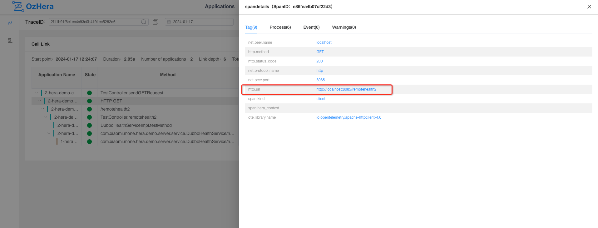

#### 6) Exclude User-Agent

Exclude based on Http user-agent, supporting fuzzy matching. The request's User-Agent can be viewed in the tags of the trace HTTP node. Examples: `chrome8.5`, or a User-Agent carried by a company's security scan.

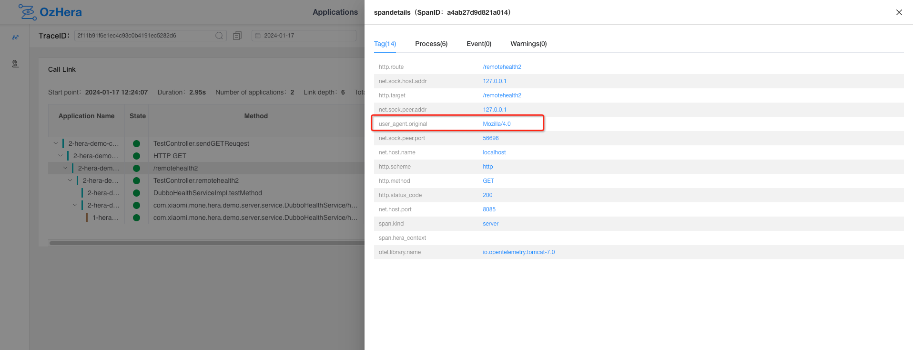

### 2. Exception and Slow Query List Settings

#### 1) RPC Time Threshold

Dubbo requests that exceed the threshold will be considered slow queries and displayed in the dubbo consumer/provider slow query list. The default is 1 second.

#### 2) DB Time Threshold

MySQL requests that exceed the threshold will be considered slow queries and displayed in the MySQL slow query list. The default is 1 second.

#### 3) Exclude HTTP Exception Codes

HTTP status codes that won't be displayed in the exception list, for example, `400` means that requests with a 400 status are not considered exception requests.


